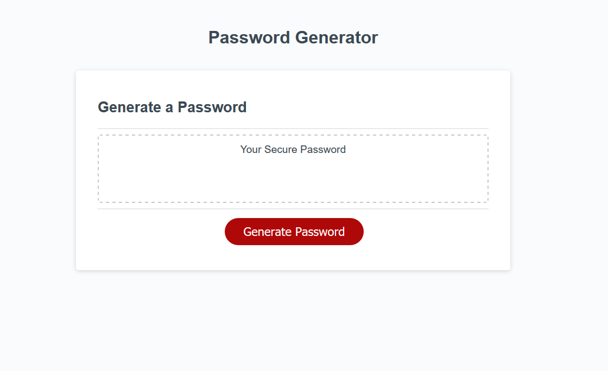
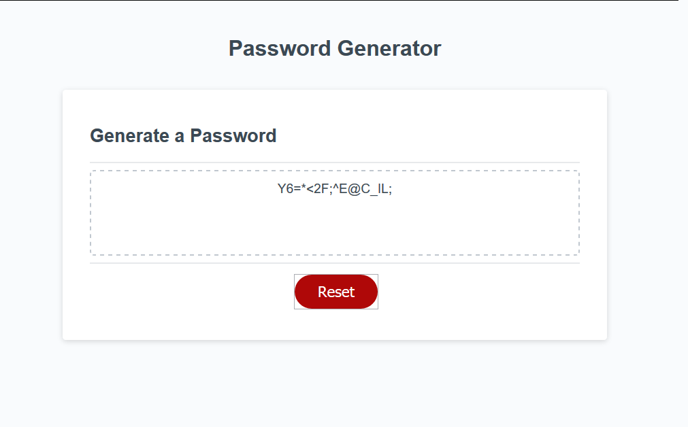

# password-generator

## Project Goals

This is a project using existing html and css. The page originally only had the elements necessary to show the basic text to the screen and added a non-functional button.

The goal of the project is to reform the page so that the user may randomly generate a password from a set of criteria.

## Gooooaaaal!

My edits give the button on the page functionally such as dynamically adding/removing forms to and from the page and submitting data from the forms as well as handles most flow control of the password generation functionality.

With the page now you are able to select two criteria for generating a password; the length of the password from 8 to 128 character and the types of characters allowed between lowecase, uppercase, numeric and special (at least one must be selected). Once this is done a randomly generated password is given following the criteria. This may then be reset to allow the user to re-select criteria and generate a new password.

## Project Snapshots

